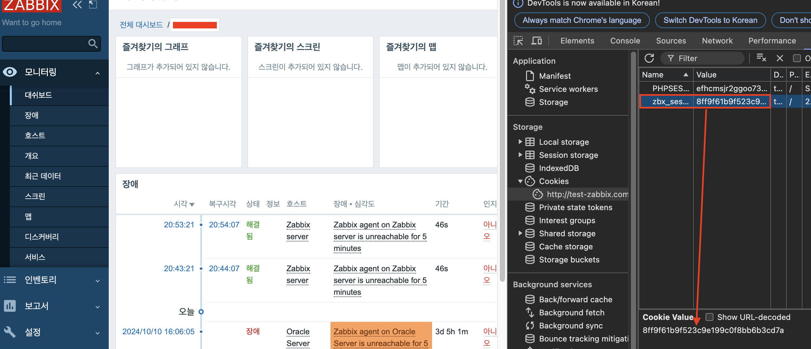

# Zabbix 점검 스크립트 사용 방법

> [!NOTE]
> 해당 스크립트는 Zabbix 5.0, 6.0, 7.0 메이저 버전에서 테스트를 진행하였으며, 그 외 메이저 버전에서는 정상적으로 작동되지 않을 수 있습니다.  
> Zabbix Server 프로세스를 중심으로 체크하도록 구성되어 있으며, 향 후 Zabbix Proxy 프로세스도 체크할 수 있도록 업데이트 할 예정입니다.

  

* * *

  

## 점검 스크립트 내용

*   점검 스크립트에는 아래와 같은 데이터가 포함되어 있습니다.
    *   엑셀 데이터
        *   호스트 리스트 및 호스트 연결 상태  
            
            
        *   수집 불가능한 아이템 리스트  
            
            
        *   특정 기간으로 부터 지금 까지 발생한 장애 리스트  
            
            
              
              
            
        *   특졍 기간으로 부터 지금 까지 해결된 장애 리스트  
            
            
              
              
            
        *   Zabbix Server 프로세스 중 75% 이상 사용된 프로세스  
            
            
              
              
            
    *   Zabbix 서버의 프로세스 사용 현황  
        
        
          
          
          
        

* * *

  

## 스크립트 사용 방법

###  1. 공통 스크립트 수정 필요 사항

  

1.  BaseURL : Zabbix의 BaseURL 주소 입력 → ex ) [http://127.0.0.1/zabbix](http://127.0.0.1/zabbix)
2.  zbx\_session : Zabbix 웹 브라우저로 관리자 권한을 가진 계정으로 로그인 후 웹 브라우저 쿠키의 zbx\_session 값 입력  
      
    
    
      
      
      
    
3.  Utilization\_Parameter 내 hostids : zabbix server의 hostid 값 입력  
      
    
    ```
    Utilization_Parameter = {
            'output' : ['itemid','name'],
            'search':{
                    'name': ['Zabbix server: utilization']   
            },
            'startSearch': True,
            'serachByAny' : True,
            'hostids' : '{Hostid값}'
        }
    ```
    
      
      
    1.  Hostid 값 확인 방법 : Zabbix Server의 호스트 접근 후 상단 URL의 hostid 값 확인  
          
        
        

  

* * *

  

### 2\. 스크립트 실행 방법

  

1.  pip3 모듈을 이용하여 관련 패키지 다운로드  
      
    
    ```
    pip3 install -r requirements
    ```
    
      
      
      
    
2.  스크립트 실행을 위한 변수 입력  
      
    
    ```
    (zabbix-maintenance) gongdoli@gongdolis-MacBook-Air-2 Zabbix-Maintenance % python3 Zabbix-Inspect-6.0Ver.py --help
    usage: Zabbix-Inspect-6.0Ver.py [-h] [--token TOKEN] [--date DATE]
    
    Get Zabbix Inspection Info
    
    options:
      -h, --help     show this help message and exit
      --token TOKEN  Please Insert Zabbix Super Admin access token
      --date DATE    Please Insert from date value to check import problem and event. ex) 2024-09-30
    ```
    
      
      
    1.  token : Zabbix 5.0 버전의 경우 zbx\_session 값, 6.0 버전 이상의 경우 API Token 키 발급 후 Token 키 입력  
          
        1.  5.0 버전  
            
            
              
              
            
        2.  6.0 버전 이상  
            
            
              
              
              
            
    2.  date : Zabbix 에서 특정 기간으로 부터 발생한 장애 리스트 출력을 위한 날짜 입력 → ex ) 2024-10-01 식으로 입력 필요.  
          
        
3.  스크립트 실행  
    
    ```
    python3 Zabbix-Inspect-{Version}Ver.py --token {Token 값 입력} --date 2024-10-01
    ```